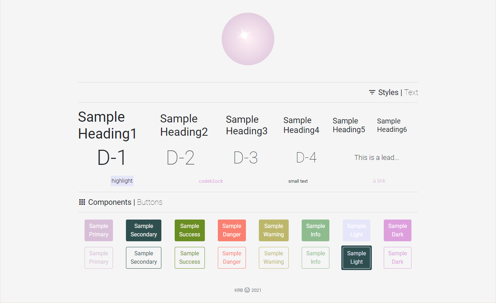

# Adventures in Sass :star2:

### Creating a local custom Bootstrap CSS library by modifying the built-in Sass variables.

## *Description*
I am using this style gallery as a personal Sass tutorial. I will be updating the repo with new custom styles as I learn more about Sass in my spare time.

## *Credits*
### :file_folder: [Bootstrap 4: Theming Docs](https://getbootstrap.com/docs/4.0/getting-started/theming/)

## *Contact*
🔗 Links in Bio @[katsign](https://github.com/katsign)

---
&copy; 2021
